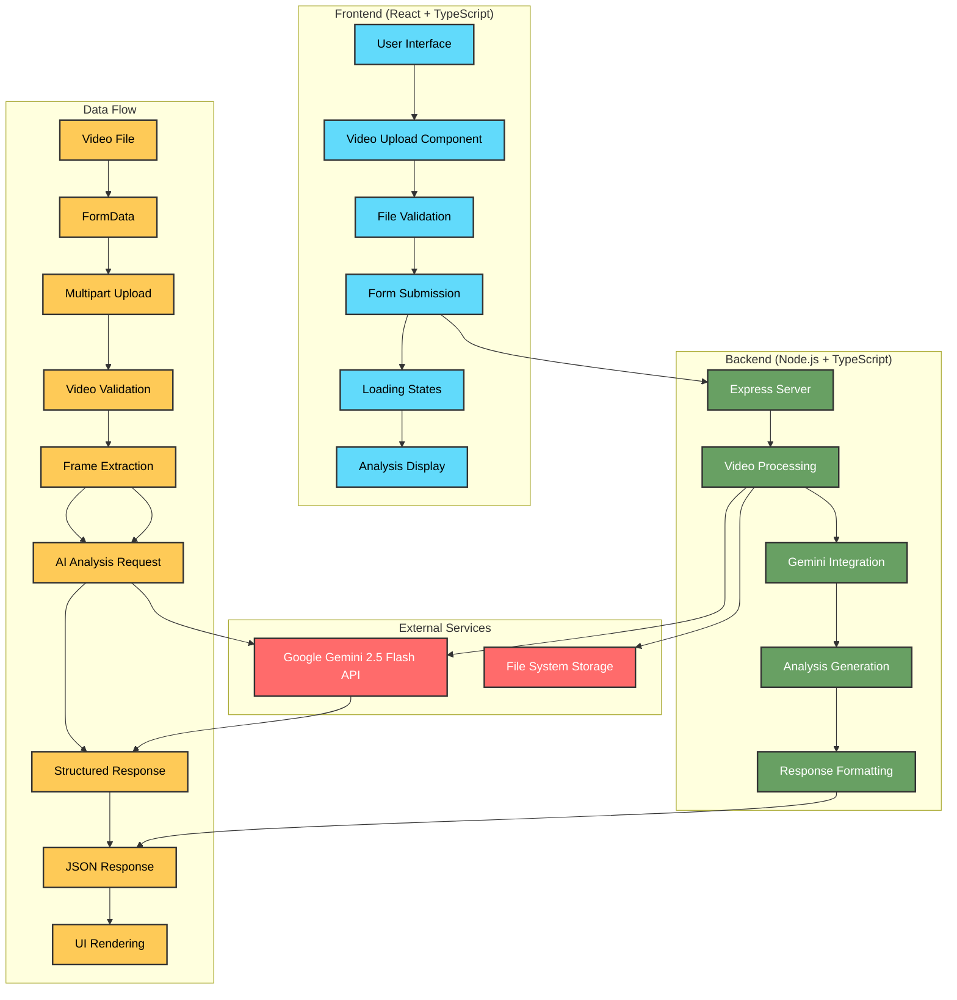

# GuitarGPT

A guitar playing analyzer powered by Gemini 2.5 Flash.

This project provides a clean interface to upload playing via video and sends it to Gemini to be analyzed.

## Features

- Upload guitar practice videos (max 5 seconds)
- AI-powered analysis using Gemini 2.5 Flash
- Personalized practice routines
- Song recommendations
- Detailed feedback on strengths and areas for improvement

## Tech Stack

- **Frontend**: React + TypeScript + Tailwind CSS
- **Backend**: Node.js + TypeScript
- **AI**: Google Gemini 2.5 Flash
- **Video Processing**: Custom video analysis pipeline

## Architecture



### System Components

#### Frontend Layer
- **React Application**: Modern UI built with TypeScript and Tailwind CSS
- **Video Upload**: Drag-and-drop interface with file validation
- **Real-time Feedback**: Loading states and progress indicators
- **Analysis Display**: Interactive results with practice recommendations

#### Backend Layer
- **Express Server**: RESTful API endpoints for video processing
- **Video Processing Pipeline**: Frame extraction and analysis preparation
- **Gemini Integration**: AI-powered guitar playing analysis
- **Response Handling**: Structured data formatting and error management

#### External Services
- **Google Gemini 2.5 Flash**: Advanced AI model for guitar technique analysis
- **File System**: Temporary video storage during processing

#### Data Flow
1. **Upload**: User selects video file (max 30 seconds)
2. **Validation**: Client-side duration and format checks
3. **Processing**: Server extracts video frames and prepares for AI analysis
4. **Analysis**: Gemini AI analyzes playing technique and provides feedback
5. **Response**: Structured analysis results returned to frontend
6. **Display**: Interactive results shown to user with practice recommendations

## Prerequisites

- Node.js (v18 or higher)
- npm or yarn
- Google Gemini API key

## Installation & Setup

### 1. Clone the Repository

```bash
git clone https://github.com/yourusername/guitarGPT.git
cd guitarGPT
```

### 2. Environment Configuration

Create a `.env` file in the `backend` directory:

```bash
cd backend
touch .env
```

Add your Gemini API key to the `.env` file:

```env
GEMINI_API_KEY=your_gemini_api_key_here
```

**Note**: Replace `your_gemini_api_key_here` with your actual Gemini API key from [Google AI Studio](https://makersuite.google.com/app/apikey).

### 3. Install Dependencies

Install backend dependencies:

```bash
cd backend
npm install
```

Install frontend dependencies:

```bash
cd ../frontend
npm install
```

### 4. Start Development Servers

Start the backend server (from the `backend` directory):

```bash
cd backend
npm run dev
```

The backend will start on `http://localhost:3001`

Start the frontend development server (from the `frontend` directory):

```bash
cd frontend
npm run dev
```

The frontend will start on `http://localhost:5173`

### 5. Access the Application

Open your browser and navigate to `http://localhost:5173` to access the GuitarGPT interface.

## Development

### Available Scripts

**Backend:**
- `npm run dev` - Start development server
- `npm run build` - Build for production
- `npm start` - Start production server

**Frontend:**
- `npm run dev` - Start development server
- `npm run build` - Build for production
- `npm run preview` - Preview production build

### Project Structure

```
guitarGPT/
├── frontend/          # React frontend application
│   ├── src/          # Source code
│   ├── public/       # Static assets
│   └── package.json  # Frontend dependencies
├── backend/          # Node.js backend server
│   ├── src/          # Source code
│   ├── .env          # Environment variables
│   └── package.json  # Backend dependencies
├── shared/           # Shared TypeScript types
└── scripts/          # Development and deployment scripts
```

## API Endpoints

- `POST /api/analyze-guitar-playing` - Upload and analyze guitar video

## Contributing

1. Fork the repository
2. Create a feature branch (`git checkout -b feature/amazing-feature`)
3. Commit your changes (`git commit -m 'Add some amazing feature'`)
4. Push to the branch (`git push origin feature/amazing-feature`)
5. Open a Pull Request

## License

This project is licensed under the MIT License - see the [LICENSE](LICENSE) file for details. 